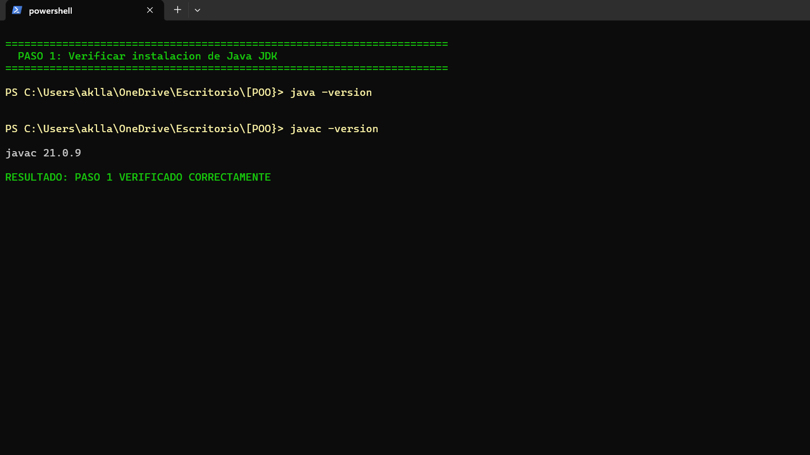
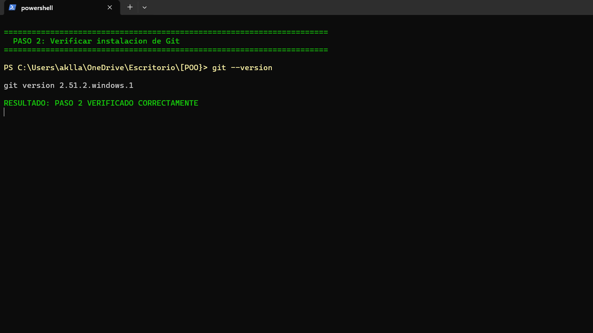
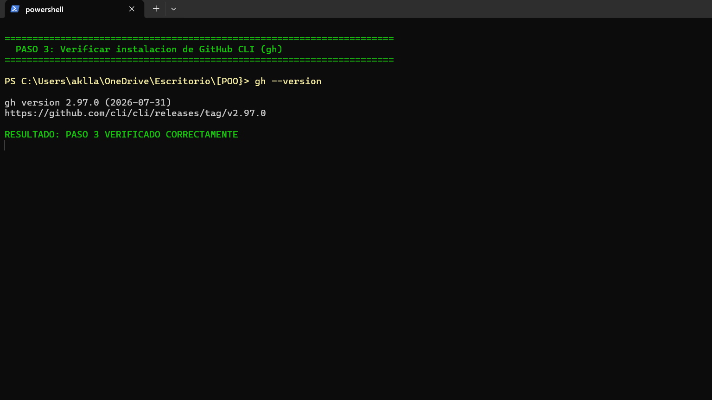
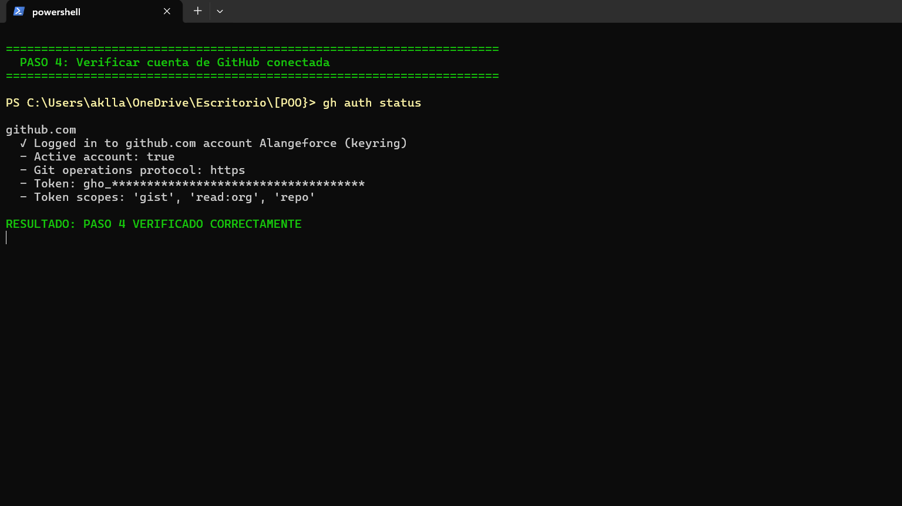
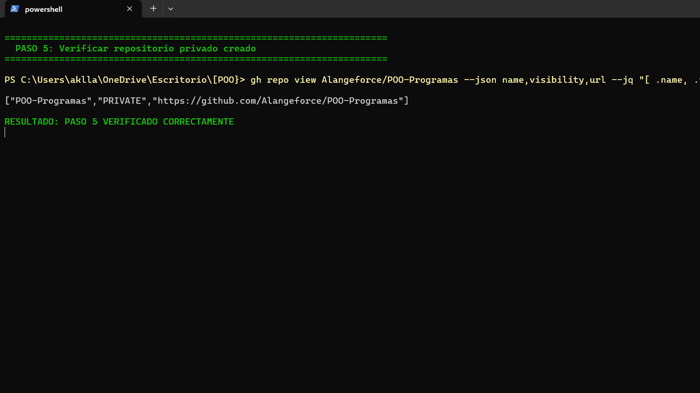
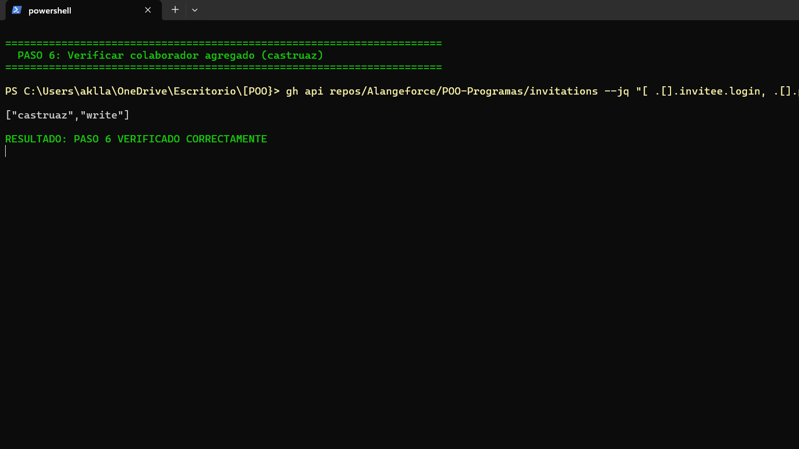
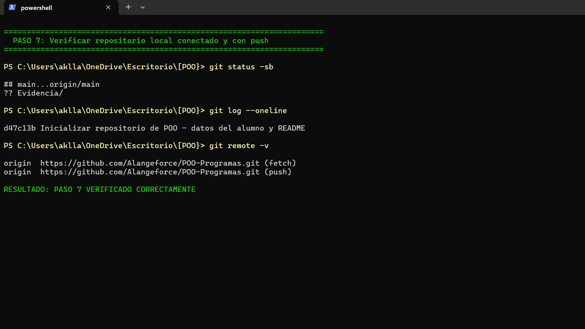
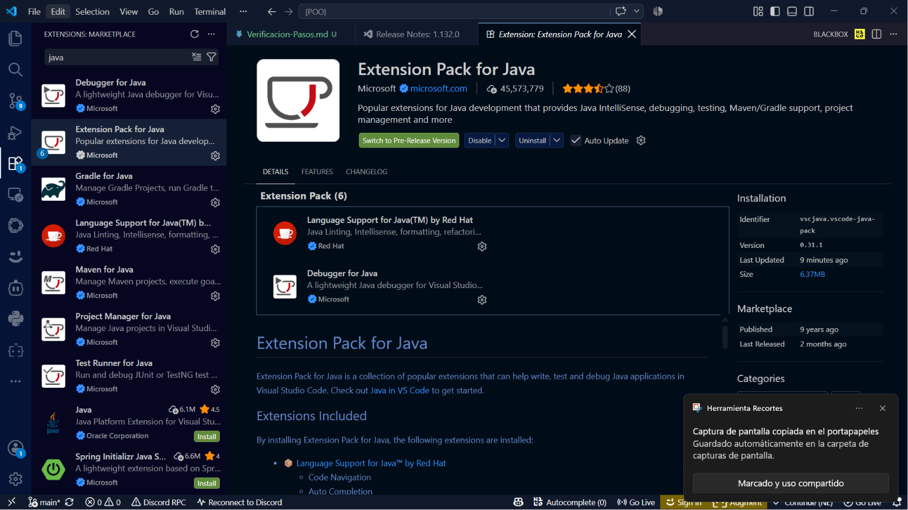
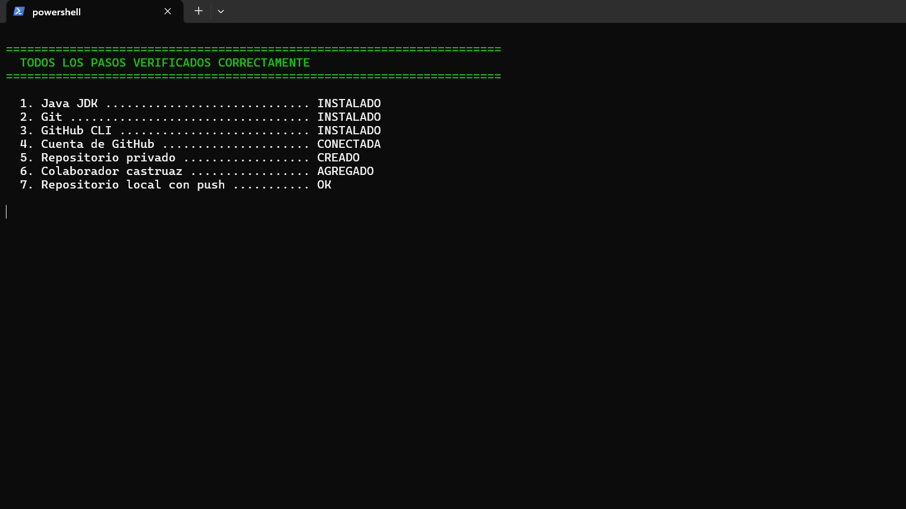

# Evidencia: Verificación de la Configuración Completa

**Alumno:** Alan Alfonso Contreras Montalvo
**Clase:** POO
**Repositorio:** [Alangeforce/POO-Programas](https://github.com/Alangeforce/POO-Programas) (privado)

Capturas de pantalla de la terminal donde se verifica que todos los pasos se realizaron correctamente.

---

## Paso 1: Verificar instalación de Java JDK

`java -version` y `javac -version` confirman que el JDK está instalado.

---

## Paso 2: Verificar instalación de Git

`git --version` confirma que Git está instalado.

---

## Paso 3: Verificar instalación de GitHub CLI

`gh --version` confirma que GitHub CLI está instalado.

---

## Paso 4: Verificar cuenta de GitHub conectada

`gh auth status` confirma que la cuenta **Alangeforce** está autenticada.

---

## Paso 5: Verificar repositorio privado creado

Se confirma el repositorio privado `POO-Programas` y su URL.

---

## Paso 6: Verificar colaborador agregado

Se confirma que el profesor **castruaz** fue agregado como colaborador (con permiso de escritura).

---

## Paso 7: Verificar repositorio local conectado y con push

`git status`, `git log` y `git remote` confirman que el repositorio local está sincronizado con GitHub.

---

## Extensión de Java en Visual Studio Code

Evidencia de la extensión de Java instalada en Visual Studio Code (Extension Pack for Java).

---

## Resumen final

Todos los pasos fueron verificados correctamente.

